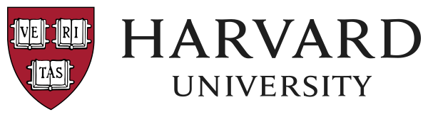
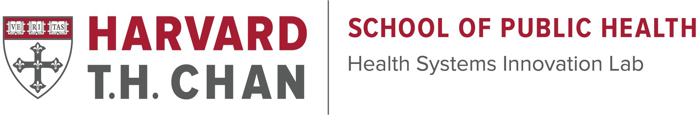
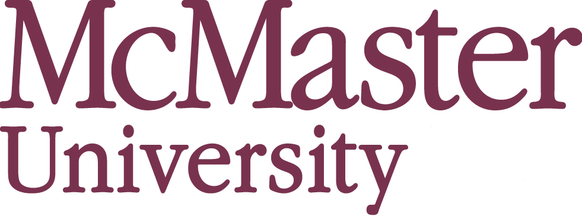
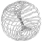

<pre align="center">
                              /
                   __       //
                   -\= \=\ //
                 --=_\=---//=--
               -_==/  \/ //\/--
                ==/   /O   O\==--
   _ _ _ _     /_/    \  ]  /--
  /\ ( (- \    /       ] ] ]==-
 (\ _\_\_\-\__/     \  (,_,)--
(\_/                 \     \-
\/      /       (   ( \  ] /)
/      (         \   \_ \./ )
(       \         \      )  \
(       /\_ _ _ _ /---/ /\_  \
 \     / \     / ____/ /   \  \
  (   /   )   / /  /__ )   (  )
  (  )   / __/ '---`       / /
  \  /   \ \             _/ /
  ] ]     )_\_         /__\/
  /_\     ]___\
 (___)
</pre>

<h1 align="center">David George</h1>

  <b>AI × Biotech × Healthcare</b> 
  Biochemistry @ McMaster · Founder & CEO, Sunbeam Health

  
  
  

---

## Most of my work isn't here

This profile looks sparse **on purpose**.

A lot of what I build is private - sensitive **biocomputational** research, company IP, and client projects that can't live in public repos. What you see here is only a small slice.

**Want the real picture?** Video demos, full project writeups, and everything else are on my resume:

**[→ Resume (Google Doc) - demos & projects](https://docs.google.com/document/d/1zJ7RKYhfhI3HWryfeyn8YHlV23jaTOMNknj_pOGDNmQ/edit?usp=sharing)**

---

## Currently

- **Founder & CEO** - Sunbeam Health · AI-native intake for ADHD clinics  
  Incubated by **Harvard HSIL** *(1st in Canada hub / top 50 out of 14,700+)* and **McMaster University**
- **Computational biology** - scRNA-seq analysis, cell-cell communication (LIANA), protein / antibody & minibinder modeling (ESM3, AlphaFold), and other generative / predictive AI for bio
- **Building** - OpenGeneEdit and other AI × bio tools

---

## Stack

  

  
  
  
  
  
  

---

## Highlights

  
  &nbsp;&nbsp;&nbsp;
  
  &nbsp;&nbsp;&nbsp;
  
  &nbsp;&nbsp;&nbsp;
  

  
  
  

- **Harvard HSIL + McMaster** - Sunbeam Health incubated by both · Harvard HSIL top **50 / 14,700+** (1st in Canada hub)
- **McMaster University** - Honours Biochemistry, B.HSc. · GPA **3.99/4.00**
- **Breakthrough Junior Challenge** - 1st in Canada (2024) · global top 15 (2025)

---

## Selected work

| Project | What it is |
|:--------|:-----------|
| **Sunbeam Health** | AI intake engine for ADHD clinics |
| **OpenGeneEdit** | AI plasmid design - Gemma + RAG over BioBricks |
| **Relay** | Patient intake, triage & clinical assistant |
| **Glaucoma CNN** | PyTorch on ~20k retinal scans · >98% accuracy |

Demos for these (and more) → **[resume](https://docs.google.com/document/d/1zJ7RKYhfhI3HWryfeyn8YHlV23jaTOMNknj_pOGDNmQ/edit?usp=sharing)**

---

  <i>Public repos ≠ full portfolio. Check the resume.</i>

